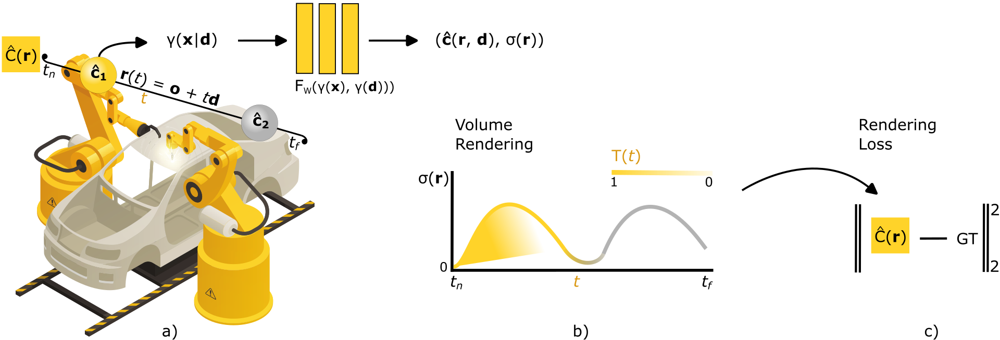

# Neural Radiance Fields in the Industrial and Robotics Domain: Applications, Research Opportunities and Use Cases
[[PAPER]](https://doi.org/10.1016/j.rcim.2024.102810) 

The project IISNeRF is the implementation of two proof-of-concept experiments: <br>
I. UAV video compression using Instant-NGP, <br>
II. Obstacle avoidance using D-NeRF.

## Abstract
The proliferation of technologies, such as extended reality (XR), has increased the demand for high-quality three-dimensional (3D) graphical representations. Industrial 3D applications encompass computer-aided design (CAD), finite element analysis (FEA), scanning, and robotics. However, current methods employed for industrial 3D representations suffer from high implementation costs and reliance on manual human input for accurate 3D modeling. To address these challenges, neural radiance fields (NeRFs) have emerged as a promising approach for learning 3D scene representations based on provided training 2D images. Despite a growing interest in NeRFs, their potential applications in various industrial subdomains are still unexplored. In this paper, we deliver a comprehensive examination of NeRF industrial applications while also providing direction for future research endeavors. We also present a series of proof-of-concept experiments that demonstrate the potential of NeRFs in the industrial domain. These experiments include NeRF-based video compression techniques and using NeRFs for 3D motion estimation in the context of collision avoidance. In the video compression experiment, our results show compression savings up to 48% and 74% for resolutions of 1920x1080 and 300x168, respectively. The motion estimation experiment used a 3D animation of a robotic arm to train Dynamic-NeRF (D-NeRF) and achieved an average peak signal-to-noise ratio (PSNR) of disparity map with the value of 23 dB and an structural similarity index measure (SSIM) 0.97.



Fig. 1. (a) A 5D coordinate (spatial location in 3D coupled with directional polar angles) is transformed into a higher-dimensional space by positional
encoding <em>γ</em>. It serves as an input for MLP <em>F<sub>W</sub></em> . The output from <em>F<sub>W</sub></em> consists of gradually learned color <em><b>&#x0109</b></em> and volume density σ for the corresponding 5D
input coordinate. <em><b>r</b></em>, <em><b>d</b></em>, <em><b>x</b></em> denote the ray vector, direction vector and spatial location vector, respectively. (b) Pixel values are obtained via volume rendering
with numerically integrated rays bounded by respective near and far bounds <em>t<sub>n</sub></em> and <em>t<sub>f</sub></em>. (c) Ground truth pixels from training set images are used to calculate
rendering loss and optimize the <em>F<sub>W</sub></em> weights via backpropagation.

## 1. Proof-of-concept I.: UAV video compression using Instant-NGP

Fig. 2. (a) A UAV camera captures the environment. The real frame and pose of the camera are transmitted wirelessly to a nearby multiaccess edge computing
(MEC) server. (b) The MEC server employs the NeRF model for novel view synthesis based on camera pose. The H.264 codec encodes real and NeRF frames
to obtain P frame containing their differences, which is transferred through the network with the pose. (c) Receiver rebuilds the real frame using H.264 codec
from P frame and locally generated NeRF frame from camera pose.

## 2. Proof-of-concept II.: Obstacle avoidance using D-NeRF

Fig. 7. a) A UAV with a specific camera pose captures the object at time t. b) The D-NeRF model outputs novel views from the camera pose at specified
time t in the form of an RGB map, opacity map and disparity map depicted in Fig. 8. c) The opacity map and disparity map are key components for UAVs
to perform obstacle avoidance or path planning.

## 3. Setup
```
git clone https://github.com/Maftej/iisnerf.git
cd src
conda create -n nerf_robotics python=3.10
conda activate nerf_robotics
pip install -r requirements.txt
```

### 3.1 Data
You can download all files used for both proof-of-concept-experiments using the [link](https://tukesk-my.sharepoint.com/:u:/g/personal/matus_dopiriak_tuke_sk/EYn9gpX_Zp5Btosi3tXJrhgB2iMkD6KI71p1r9pNUtTNSQ?e=TMkALM).
Detailed structure of folders is located in the [section 5](#5-structure-of-folders).


### 3.2 Complete simulation parameters of proof-of-concept I.

| NeRF variant                                       | [Instant-NGP](https://github.com/NVlabs/instant-ngp)                                                                                                                                                                                                                                                                                                      |
|----------------------------------------------------|-----------------------------------------------------------------------------------------------------------------------------------------------------------------------------------------------------------------------------------------------------------------------------------------------------------------------------------------------------------|
| abbreviated Instant-NGP repository commit hash     | 11496c211f                                                                                                                                                                                                                                                                                                                                                |
| AABB                                               | 128                                                                                                                                                                                                                                                                                                                                                       |
| 3D modelling software                              | Blender 3.4                                                                                                                                                                                                                                                                                                                                               |
| 3D renderer                                        | Eevee                                                                                                                                                                                                                                                                                                                                                     |
| Blender plugin for creation of a synthetic dataset | [BlenderNeRF 3.0.0](https://github.com/maximeraafat/BlenderNeRF)                                                                                                                                                                                                                                                                                          |
| BlenderNeRF dataset method                         | Subset of Frames (SOF)                                                                                                                                                                                                                                                                                                                                    |
| view sampling interval in a training dataset       | 5 times each 4th frame out of 100 and 1 time each 3rd frame out of 100                                                                                                                                                                                                                                                                                    |
| third-party 3D models and textures                 | [factory building](https://www.turbosquid.com/3d-models/max-warehouse-pbr-gaming/1017253), [animated robotic exhaust pipe welding](https://sketchfab.com/3d-models/demo-robotic-exhaust-pipe-welding-d3b8f5439e624ff18d26ca43ba302a0a), [garage doors in the original resolution 5184x3456](https://www.pexels.com/photo/corrugated-metal-sheet-3312575/) |
| scene lighting                                     | [HDR map in a 1K resolution](https://polyhaven.com/a/derelict_highway_midday)                                                                                                                                                                                                                                                                             |
| training view count                                | 159                                                                                                                                                                                                                                                                                                                                                       |
| image resolutions used for training                | 1920x1080                                                                                                                                                                                                                                                                                                                                                 |
| image resolutions used for evaluation of image quality and compression                 | 300x168, 500x280, 720x404, 1920x1080                                                                                                                                                                                                                                                                                                                      |
| H.264 codec                                        | x264 (as a part of the FFMPEG library N-109741-gbbe95f7353-20230201)                                                                                                                                                                                                                                                                                      |
| multimedia content inspector                       | FFPROBE library N-109741-gbbe95f7353-20230201                                                                                                                                                                                                                                                                                                             |
| number of images encoded into single .h264 file    | 2                                                                                                                                                                                                                                                                                                                                                         |
| Constant Rate Factor (CRF)                         | 18, 23, 28                                                                                                                                                                                                                                                                                                                                                |
| Preset                                             | Veryslow, Medium, Veryfast                                                                                                                                                                                                                                                                                                                                |


### 3.3 Complete simulation parameters of proof-of-concept II.

| NeRF variant                                             | [D-NeRF](https://github.com/albertpumarola/D-NeRF)                                                                                                       |
|----------------------------------------------------------|------------------------------------------------------------------------------------------------------------------|
| abbreviated D-NeRF repository commit hash                | 89ed431fe1                                                                                                       |
| number of training iterations                            | 750 000                                                                                                          |
| number of coarse samples per ray                         | 128                                                                                                              |
| number of additional fine samples per ray                | 160                                                                                                              |
| batch size (number of random rays per gradient step)     | 512                                                                                                              |
| number of steps to train on central time                 | 500                                                                                                              |
| number of rays processed in parallel                     | 1024*40                                                                                                          |
| number of points sent through the network in parallel    | 1024*70                                                                                                          |
| frequency of tensorboard image logging                   | HDR map in a 1K resolution                                                                                       |
| training view count                                      | 100 000                                                                                                          |
| frequency of weight ckpt saving                          | 50 000                                                                                                           |
| frequency of testset saving                              | 50 000                                                                                                           |
| frequency of render_poses video saving                   | 100 000                                                                                                          |
| 3D modelling software                                    | Blender 3.4                                                                                                      |
| 3D Renderer                                              | Eevee                                                                                                            |
| view sampling count in a training dataset                | 3 times each frame out of 41                                                                                     |
| view sampling count in a testing and a validation dataset| 2 times each 2nd frame out of 41                                                                                 |
| view sampling count in a validation dataset              | 1 time each 2nd frame out of 41                                                                                  |
| plugin for creation of a disparity map dataset in Blender| [Light Field Camera 0.0.1](https://github.com/gfxdisp/Blender-addon-light-field-camera)                          |
| cols and rows                                            | 1                                                                                                                |
| base x and base y                                        | 0.3                                                                                                              |
| third-party 3D models                                    | [animated robotic arm](https://sketchfab.com/3d-models/black-honey-robotic-arm-c50671f2a8e74de2a2e687103fdc93ab) |
| training / testing / validation view count               | 123 / 21 / 21                                                                                                    |
| image resolutions used for training and all maps         | 800x800                                                                                                          |
| focal                                                    | 1113                                                                                                             |
| near and far bounds                                      | 2 and 6                                                                                                          |


## 4. Scenarios

### 4.1 Training tips (Blender synthetic dataset)
1. Camera cannot be inside object while moving. It causes artifacts in the form of cut objects.

### 4.2 Scenarios for all NeRF variants (Instant-NGP & D-NeRF)
1. TRAIN -> training of NeRF variant using single dataset and storage of the pretrained scene in a specific format.
2. MERGE_DATASETS -> fusion of several datasets into single dataset based on the same properties besides from "frame" in transforms.json file.
3. EVAL_DATASET -> creation of evaluation dataset based on custom trajectory in transforms.json file.
4. EVAL_TRAJECTORY -> evaluation of a custom trajectory (ground truth image vs NeRF generated image). 

### 4.3 Scenarios for Instant-NGP
1. TEST_DATASET -> creation of testing dataset from pretrained Instant-NGP (from .ngp file) based on poses from transforms.json.
2. EVAL_MODELS -> evaluation of Instant-NGP models with different AABB value, e.g., images from the same poses (ground truth image vs NeRF generated image) using PSNR and SSIM.
3. IPFRAME_DATASET -> creation of dataset composed of ground truth and NeRF images from the same trajectory (the same NeRF and ground truth are encoded).
4. ENCODE_IPFRAME_DATASET -> encoding of IPFRAME dataset using H.264 codec with different configurations settings as preset and Constant Rate Factor (CRF).
5. EVAL_ENCODED_IPFRAME -> extraction of P-slice size of IPFRAME dataset.

### 4.4 Scenarios for D-NeRF
1. PLOT_ALL_MAPS -> rendering, processing and plotting of RGB, disparity and accumulated opacity maps.
2. PLOT_DATA -> plotting all data used in the research paper.

### 4.5 NeRF variants --nerf_variant "INSTANT_NGP"
1. D_NERF
2. INSTANT_NGP

### 4.6 Scenarios --scenario "MERGE_DATASETS"
1. MERGE_DATASETS
2. TRAIN
3. TEST_DATASET
4. EVAL_MODELS
5. EVAL_DATASET
6. IPFRAME_DATASET
7. ENCODE_IPFRAME_DATASET
8. EVAL_ENCODED_IPFRAME
9. EVAL_TRAJECTORY
10. PLOT_ALL_MAPS
11. PLOT_DATA

### 4.7 IISNeRF example commands
0. conda env list, conda activate nerf_robotics
1. python iis_nerf.py --nerf_variant "INSTANT_NGP" --scenario "EVAL_ENCODED_H264" --scenario_path "C:\Users\mdopiriak\PycharmProjects\iis_nerf\scenarios\scenario_factory_robotics.json"
2. python iis_nerf.py --nerf_variant "INSTANT_NGP" --scenario "EVAL_TRAJECTORY" --scenario_path "C:\Users\mdopiriak\PycharmProjects\iis_nerf\scenarios\scenario_test.json"
3. python iis_nerf.py --nerf_variant "D_NERF" --scenario "MERGE_DATASETS" --dataset_type "TRAIN" --scenario_path "C:\Users\mdopiriak\PycharmProjects\iis_nerf\scenarios\scenario_d_nerf_arm_robot.json"
4. python iis_nerf.py --nerf_variant "D_NERF" --scenario "PLOT_ALL_MAPS" --scenario_path "C:\Users\mdopiriak\PycharmProjects\iis_nerf\scenarios\scenario_d_nerf_arm_robot.json"
5. python iis_nerf.py --nerf_variant "D_NERF" --scenario "PLOT_DATA" --scenario_path "C:\Users\mdopiriak\PycharmProjects\iis_nerf\scenarios\scenario_d_nerf_arm_robot.json"
6. python iis_nerf.py --nerf_variant "D_NERF" --scenario "TRAIN" --scenario_path "C:\Users\mdopiriak\PycharmProjects\iis_nerf\scenarios\scenario_d_nerf_arm_robot.json"

### 4.8 FFMPEG & FFPROBE commands
The list of ffmpeg commands used in the first proof-of-concept experiments:
1. ffmpeg -framerate 1 -start_number {order} -i {file_path} -frames:v 2 -c:v libx264 -preset {preset} -crf {crf} -r 1 {encoded_video_path}
2. ffprobe -show_frames {h264_encoded_video_full_path}

## 5. Structure of folders

### 5.1 Data in the cloud
```
.
└── iisnerf_data/
    ├── obstacle_avoidance_using_dnerf/
    │   ├── blender_files/
    │   │   └── blender_models/
    │   │       ├── source/
    │   │       │   └── .blend
    │   │       ├── textures/
    │   │       │   └── .jpg
    │   │       └── .blend
    │   ├── configs/
    │   │   └── arm_robot.txt
    │   ├── data/
    │   │   └── arm_robot/
    │   │       ├── test/
    │   │       │   ├── 0000.png
    │   │       │   ├── ...
    │   │       │   └── 0040.png
    │   │       ├── train/
    │   │       │   ├── 001.png
    │   │       │   ├── ...
    │   │       │   └── 123.png
    │   │       ├── val/
    │   │       │   ├── 0000.png
    │   │       │   ├── ...
    │   │       │   └── 0040.png
    │   │       ├── transforms_test.json
    │   │       ├── transforms_train.json
    │   │       └── transforms_val.json        
    │   ├── logs/
    │   │   ├── 750000.tar
    │   │   ├── args.txt
    │   │   └── config.txt
    │   └── robot_maps_data/
    │       └── arm_robot_eval_dataset/
    │           └── -> details in 5.3
    └── uav_compression_using_instant_ngp/
        ├── blender_files/
        │   ├── blender_models/
        │   │   ├── demo-robotic-exhaust-pipe-welding/
        │   │   │   ├── source/
        │   │   │   │   └── Demo Exhaust Pipe.glb
        │   │   │   ├── textures/
        │   │   │   │   └── gltf_embedded_0.jpg
        │   │   │   ├── weldings_robots.blend
        │   │   │   ├── welding_robots.mtl
        │   │   │   └── welding_robots.obj
        │   │   └── warehouse/
        │   │       └── Warehouse.fbx
        │   ├── factory_dataset_normal5
        │   ├── ...
        │   ├── factory_dataset_normal10
        │   ├── lightfield/
        │   │   └── derelict_highway_midday_1k.hdr
        │   ├── Textures/
        │   │   └── .jpg
        │   ├── factory_scene5.blend
        │   ├── ...
        │   └── factory_scene10.blend
        ├── datasets/
        │   └── factory_robotics/
        │       └── -> details in 5.2
        └── instant_ngp_models/
            ├── factory_robotics_aabb_scale_1.ingp
            ├── ...
            └── factory_robotics_aabb_scale_128.ingp
```

### 5.2 Proof-of-concept I.

```
.
└── factory_robotics/
    ├── eval/
    │   └── factory_robotics_eval/
    │       ├── images/
    │       │   ├── 0001.jpg
    │       │   ├── ...
    │       │   └── 0159.jpg
    │       ├── images_res300x168/
    │       │   ├── 0001.jpg
    │       │   ├── ...
    │       │   └── 0159.jpg
    │       ├── images_res500x280/
    │       │   ├── 0001.jpg
    │       │   ├── ...
    │       │   └── 0159.jpg
    │       ├── images_res720x404/
    │       │   ├── 0001.jpg
    │       │   ├── ...
    │       │   └── 0159.jpg
    │       ├── eval_trajectory.json
    │       ├── eval_trajectory_res300x168.json
    │       ├── eval_trajectory_res500x280.json
    │       ├── eval_trajectory_res720x404.json
    │       └── transforms.json
    ├── test/
    │   ├── images_aabb_scale_1/
    │   │   ├── 001.jpg
    │   │   ├── ...
    │   │   └── 159.jpg
    │   ├── ...
    │   ├── images_aabb_scale_128/
    │   │   ├── 001.jpg
    │   │   ├── ...
    │   │   └── 159.jpg
    │   ├── evaluated_models.json
    │   └── transforms.json
    ├── train/
    │   ├── images/
    │   │   ├── 001.jpg
    │   │   ├── ...
    │   │   └── 159.jpg
    │   └── transforms.json
    └── videos/
        ├── factory_robotics_videos/
        │   ├── res_300x168_preset_medium_crf_18/
        │   │   ├── encoded_video1.h264
        │   │   ├── ...
        │   │   ├── encoded_video159.h264
        │   │   └── pkt_size_res_300x168_preset_medium_crf_18.json
        │   ├── ...
        │   └── res_1920x1080_preset_veryslow_crf_28/
        │       ├── encoded_video1.h264
        │       ├── ...
        │       ├── encoded_video159.h264
        │       └── pkt_size_res_1920x1080_preset_veryslow_crf_28.json
        └── ipframe_dataset/
            ├── images/
            │   ├── ipframe_dataset001.jpg
            │   ├── ...
            │   └── ipframe_dataset159.jpg
            ├── images_res300x168/
            │   ├── ipframe_dataset001.jpg
            │   ├── ...
            │   └── ipframe_dataset159.jpg
            ├── images_res500x280/
            │   ├── ipframe_dataset001.jpg
            │   ├── ...
            │   └── ipframe_dataset159.jpg
            └── images_res720x404/
                ├── ipframe_dataset001.jpg
                ├── ...
                └── ipframe_dataset159.jpg
```

### 5.3 Proof-of-concept II. 

```
.
└── arm_robot_eval_dataset/
    ├── d_nerf_blender_disparity_map_test/
    │   ├── 001.png
    │   ├── ...
    │   └── 021.png
    ├── d_nerf_blender_disparity_map_train/
    │   ├── 001.png
    │   ├── ...
    │   └── 123.png
    ├── d_nerf_blender_disparity_map_val/
    │   ├── 001.png
    │   ├── ...
    │   └── 021.png
    ├── d_nerf_blender_test/
    │   ├── 001.npy
    │   ├── ...
    │   └── 021.npy
    ├── d_nerf_blender_train_bottom/
    │   ├── 001.npy
    │   ├── ...
    │   └── 041.npy
    ├── d_nerf_blender_train_middle/
    │   ├── 001.npy
    │   ├── ...
    │   └── 041.npy
    ├── d_nerf_blender_train_top/
    │   ├── 001.npy
    │   ├── ...
    │   └── 041.npy
    ├── d_nerf_blender_val/
    │   ├── 001.npy
    │   ├── ...
    │   └── 021.npy
    ├── d_nerf_model_disparity_map_test/
    │   ├── 001.png
    │   ├── ...
    │   └── 021.png
    ├── d_nerf_model_disparity_map_train/
    │   ├── 001.png
    │   ├── ...
    │   └── 123.png
    ├── d_nerf_model_disparity_map_val/
    │   ├── 001.png
    │   ├── ...
    │   └── 021.png
    ├── d_nerf_model_test/
    │   ├── 001.png
    │   ├── ...
    │   └── 021.png
    ├── d_nerf_model_train/
    │   ├── 001.png
    │   ├── ...
    │   └── 123.png
    ├── d_nerf_model_val/
    │   ├── 001.png
    │   ├── ...
    │   └── 021.png
    ├── ground_truth/
    │   ├── test/
    │   │   └── .png
    │   ├── train/
    │   │   └── .png
    │   ├── val/
    │   │   └── .png
    │   └── new/
    │       ├── 001.png
    │       ├── ...
    │       └── 123.png
    └── psnr_ssim_data_d_nerf.json
```

## 6. Citation
If you use this code or ideas from the paper for your research, please cite our paper:
```
@article{slapak2024102810,
title = {Neural radiance fields in the industrial and robotics domain: Applications, research opportunities and use cases},
journal = {Robotics and Computer-Integrated Manufacturing},
volume = {90},
pages = {102810},
year = {2024},
issn = {0736-5845},
doi = {https://doi.org/10.1016/j.rcim.2024.102810},
url = {https://www.sciencedirect.com/science/article/pii/S0736584524000978},
author = {Eugen Šlapak and Enric Pardo and Matúš Dopiriak and Taras Maksymyuk and Juraj Gazda}
}
```